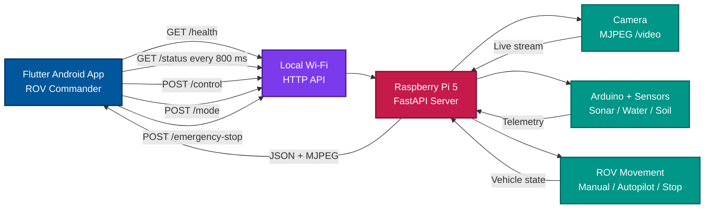
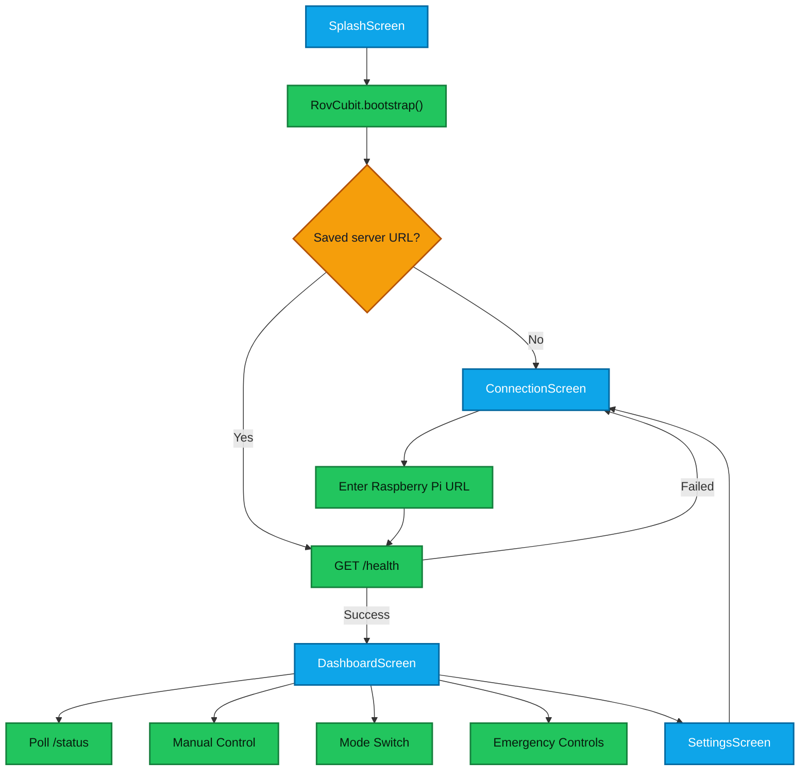

<div align="center">


# ROV Commander

### Flutter control dashboard for a Raspberry Pi 5 powered surveillance ROV

[](https://flutter.dev)
[](https://dart.dev)
[](https://developer.android.com)
[](https://www.raspberrypi.com)
[](https://fastapi.tiangolo.com)

**Real-time video, telemetry, manual driving, autopilot switching, and emergency control from a Flutter Android app.**

[Connected Raspberry Pi Server](https://github.com/Azrul16/ROV-Commander-RasberryPi5-Server-) . [Flutter App](#getting-started) . [API Contract](#api-contract) . [Troubleshooting](#troubleshooting)

</div>

---

## Connected Project

This Flutter app is designed to work together with the Raspberry Pi 5 backend server:

<div align="center">

| Mobile Controller | Network Link | Raspberry Pi Server |
|---|---|---|
| Flutter Android dashboard | Local Wi-Fi / HTTP | FastAPI server on Raspberry Pi 5 |
| Manual controls, video UI, telemetry panels | `http://<pi-ip>:8000` | Camera stream, sensors, Arduino bridge, vehicle commands |

[](https://github.com/Azrul16/ROV-Commander-RasberryPi5-Server-)

</div>

## System Flow



## What It Does

ROV Commander turns an Android phone into a live operator console for a Raspberry Pi powered ROV. The app connects to the Pi over local Wi-Fi, renders the MJPEG camera feed, polls telemetry in real time, and sends movement, mode, and emergency commands to the server.

It is built for robotics, surveillance, IoT, and learning projects where the mobile app should stay focused on control and monitoring while the Raspberry Pi handles hardware, camera, sensors, and vehicle command execution.

## Highlights

<div align="center">

| Control | Vision | Telemetry | Safety |
|---|---|---|---|
| Press-and-hold driving controls | MJPEG live camera stream | Sonar, water, soil, camera, Arduino, server status | Emergency stop and emergency clear |
| Manual and autopilot modes | Full-screen video view | Polling every `800 ms` | Stop on pointer release and app lifecycle changes |
| Flexible server URL setup | Retry support | Connection warnings | Disabled controls when unsafe |

</div>

## Feature Map

- First-launch Raspberry Pi server setup.
- Saved server URL using `SharedPreferences`.
- URL normalization for IP addresses, hostnames, and full URLs.
- FastAPI health check before opening the dashboard.
- Live status polling every `800 ms`.
- MJPEG video rendering from `/video`.
- Full-screen live video mode.
- Press, hold, release, and cancel handling for manual driving.
- Manual and autopilot mode switching.
- Emergency stop and emergency clear controls.
- Sonar, water, soil, vehicle, camera, Arduino, and server status panels.
- Dark Material 3 robotics dashboard theme.

## Tech Stack

| Layer | Tools |
|---|---|
| App framework | Flutter `3.x`, Dart `3.12.x` |
| State management | `bloc`, `flutter_bloc` |
| Networking | `dio`, `retrofit`, `retrofit_generator` |
| Storage | `shared_preferences` |
| Connectivity | `connectivity_plus` |
| Video | `flutter_mjpeg` |
| Backend target | Raspberry Pi 5 FastAPI server |

## App Flow



## Project Structure

```text
lib/
|-- main.dart
|-- app.dart
|-- blocs/
|   `-- rov_cubit.dart
|-- core/
|   |-- app_theme.dart
|   |-- constants.dart
|   `-- url_helper.dart
|-- models/
|   |-- camera_data.dart
|   |-- environment_data.dart
|   |-- health_status.dart
|   |-- rov_status.dart
|   |-- sonar_data.dart
|   `-- vehicle_status.dart
|-- screens/
|   |-- connection_screen.dart
|   |-- dashboard_screen.dart
|   |-- full_screen_video_screen.dart
|   |-- settings_screen.dart
|   `-- splash_screen.dart
|-- services/
|   |-- api_service.dart
|   |-- rov_api_client.dart
|   |-- rov_api_client.g.dart
|   `-- storage_service.dart
`-- widgets/
    |-- connection_banner.dart
    |-- emergency_stop_button.dart
    |-- environment_panel.dart
    |-- manual_control_pad.dart
    |-- mode_switch_card.dart
    |-- sonar_panel.dart
    |-- status_card.dart
    `-- video_stream_card.dart
```

## Architecture

| Component | Responsibility |
|---|---|
| `main.dart` | Starts the Flutter app. |
| `app.dart` | Wires the root `BlocProvider`, theme, and startup router. |
| `RovCubit` | Owns bootstrap, connection, polling, commands, mode switching, emergency control, and lifecycle stop handling. |
| `RovState` | Immutable UI state consumed by `BlocBuilder`. |
| `ApiService` | Domain-facing API wrapper around Retrofit responses. |
| `RovApiClient` | Retrofit interface for the Raspberry Pi server. |
| `StorageService` | Reads and writes the saved base URL. |
| Screens and widgets | Render UI and call Cubit methods for actions. |

## Raspberry Pi Server Requirements

The app expects the companion FastAPI server to be reachable from the phone on the same local Wi-Fi network.

```text
Default port: 8000
Example URL:  http://192.168.1.193:8000
```

Server repository:

```text
https://github.com/Azrul16/ROV-Commander-RasberryPi5-Server-
```

The Android app enables cleartext HTTP traffic for local network access.

## API Contract

### `GET /health`

```json
{
  "status": "online",
  "default_mode": "manual",
  "camera_connected": true,
  "arduino_connected": true,
  "sonar_updated_at": 1781645000.123
}
```

### `GET /status`

Polled every `800 ms`. The Cubit avoids starting another poll while a previous poll is still running.

```json
{
  "vehicle": {
    "mode": "manual",
    "movement": "stopped",
    "speed": 0.5,
    "emergency_stop": false,
    "autopilot_action": "inactive",
    "reason": "manual mode",
    "updated_at": 1781645000.123
  },
  "sonar": {
    "left_cm": 58.4,
    "center_cm": 74.2,
    "right_cm": 43.9,
    "obstacle_present": false,
    "updated_at": 1781645000.123
  },
  "arduino": {
    "connected": true,
    "water_raw": 430,
    "water_detected": true,
    "soil_raw": 387,
    "soil_wet": true,
    "error": null,
    "updated_at": 1781645000.123
  },
  "camera": {
    "connected": true,
    "frame_count": 5423,
    "object_detected": false,
    "object_detection_enabled": false,
    "updated_at": 1781645000.123
  },
  "server_time": 1781645000.123
}
```

### `GET /video`

Rendered as an MJPEG stream:

```dart
Mjpeg(
  stream: '$baseUrl/video',
  isLive: true,
)
```

### `POST /mode`

```json
{ "mode": "manual" }
```

```json
{ "mode": "autopilot" }
```

When autopilot is active, manual controls are disabled and the dashboard shows the current autopilot action and reason.

### `POST /control`

```json
{ "command": "forward", "speed": 0.5 }
{ "command": "backward", "speed": 0.5 }
{ "command": "left", "speed": 0.5 }
{ "command": "right", "speed": 0.5 }
{ "command": "stop", "speed": 0 }
```

Manual control behavior:

- Pointer down sends the movement command.
- Pointer up or pointer cancel sends `stop`.
- If a movement command fails, the Cubit attempts to send `stop`.
- App pause, inactive, detached, and hidden lifecycle states also trigger a stop attempt.

### Emergency Endpoints

```http
POST /emergency-stop
POST /emergency-clear
```

## URL Normalization

`UrlHelper.normalizeBaseUrl` accepts friendly input and converts it into the server base URL.

```text
192.168.1.193        -> http://192.168.1.193:8000
192.168.1.193:8000   -> http://192.168.1.193:8000
http://192.168.1.193 -> http://192.168.1.193:8000
```

If no port is supplied, the app uses `8000`.

## Android Permissions

```xml
<uses-permission android:name="android.permission.INTERNET" />
<uses-permission android:name="android.permission.ACCESS_NETWORK_STATE" />
<uses-permission android:name="android.permission.VIBRATE" />
```

Local HTTP access is enabled with:

```xml
android:usesCleartextTraffic="true"
```

## Getting Started

### Prerequisites

- Flutter SDK `3.x`
- Dart SDK `3.12.x`
- Android Studio or VS Code with Flutter tooling
- Android device or emulator
- Raspberry Pi FastAPI server from [ROV Commander Raspberry Pi 5 Server](https://github.com/Azrul16/ROV-Commander-RasberryPi5-Server-)

### Install And Run

```bash
git clone https://github.com/Azrul16/ROV-Commander-Flutter-App.git
cd ROV-Commander-Flutter-App
flutter pub get
dart run build_runner build
flutter run
```

### Build APK

```bash
flutter build apk --debug
flutter build apk --release
```

## Development Commands

| Task | Command |
|---|---|
| Format code | `dart format lib test` |
| Analyze code | `flutter analyze` |
| Run tests | `flutter test` |
| Generate Retrofit files | `dart run build_runner build` |
| Clean generated output | `dart run build_runner clean` |

`lib/services/rov_api_client.g.dart` is generated by `retrofit_generator`. Do not edit it by hand. Update `lib/services/rov_api_client.dart`, then regenerate.

## Fork And Contribute

Contributions are welcome. Useful improvements include UI polish, tests, documentation, Raspberry Pi API integration, new telemetry panels, and robotics features.

Fork the repository on GitHub, then work from your fork:

```bash
git clone https://github.com/<your-username>/ROV-Commander-Flutter-App.git
cd ROV-Commander-Flutter-App
git checkout -b feature/your-feature-name
dart format lib test
flutter analyze
flutter test
git add .
git commit -m "Add your clear commit message"
git push origin feature/your-feature-name
```

Before opening a pull request, make sure the app builds successfully, generated files are updated when API interfaces change, and UI changes have been tested on an Android device or emulator.

## Troubleshooting

| Problem | Check |
|---|---|
| App cannot connect | Confirm the phone and Raspberry Pi are on the same Wi-Fi network. Confirm the FastAPI server is running on port `8000`. Open `http://<pi-ip>:8000/health` from a browser on the same network. |
| Video does not show | Confirm `/video` returns an MJPEG stream. Confirm `camera.connected` is `true` in `/status`. Check that the phone can reach `http://<pi-ip>:8000/video`. |
| Manual controls are locked | Controls are disabled when the app is offline, autopilot is active, emergency stop is active, or a command is currently being sent. |
| Retrofit errors | Run `dart run build_runner clean`, then `dart run build_runner build`. |

## Star The Project

If ROV Commander helps your robotics, surveillance, IoT, or Flutter learning project, please consider starring the repository. You are welcome to fork it, customize it for your own ROV hardware, and share improvements back through pull requests.

## Author

**Azrul Amaline**

- Email: [azrul.amaline16@gmail.com](mailto:azrul.amaline16@gmail.com)

## License

No license file is currently included. Add a license before distributing or accepting significant external contributions.

<div align="center">

**ROV Commander Flutter App**<br>
Built to pair with the [ROV Commander Raspberry Pi 5 Server](https://github.com/Azrul16/ROV-Commander-RasberryPi5-Server-)

</div>
